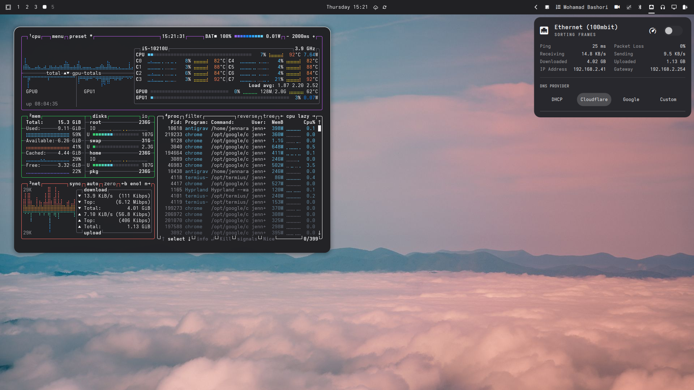

# Omarchy Minimalist Theme

> A refined, distraction-free macOS Space Gray & Graphite aesthetic crafted for [Omarchy Linux](https://omarchy.org).



---

## Highlights

- **macOS Space Gray Palette**: Dark neutral graphite canvas (`#212124`), elevated solid cards (`#28282d`), crisp Apple-style typography (`#f4f4f6`), and pure white highlights (`#ffffff`).
- **Hairline Top Accent**: Ultra-thin 1px frosted-white rim on active windows that curves along the 14px rounded corners and disappears on inactive windows.
- **Segmented Capsule Window Grouping**: Modern segmented pill bar tabs for grouped windows with solid opaque bodies, zero transparency, clean `Adwaita Sans` typography, and smooth capsule rounding.
- **Natural Shadow Elevation**: Active windows are elevated with subtle, soft drop shadows without harsh dimming on inactive windows (`dim_inactive = false`), keeping all text 100% readable.
- **Borderless Popups & Cards**: Launcher, status popups, notifications, volume OSD, and flyouts float cleanly with zero border lines (`border-width = 0`).
- **Curated HD Wallpapers**: Hand-picked scenic mountain and ocean landscapes included in `backgrounds/`.

---

## Installation

### Method 1: One-Line Install (Recommended)

Run the following command in your terminal:

```bash
omarchy theme install https://github.com/athoulmuwafiq/omarchy-minimalist-theme.git
```

### Method 2: Via Omarchy Menu

1. Copy the GitHub URL of this repository.
2. Open the Omarchy menu (`Super + Alt + Space`).
3. Navigate to **Install** > **Style** > **Theme** and paste the URL.

### Method 3: Manual Installation

Clone or copy this repository directly to your Omarchy themes folder:

```bash
git clone https://github.com/athoulmuwafiq/omarchy-minimalist-theme.git ~/.config/omarchy/themes/minimalist
omarchy-theme-set minimalist
```

---

## Switching to this Theme

Once installed, apply the theme via:

```bash
omarchy-theme-set minimalist
```

Or open the interactive theme selector with `Super + Ctrl + Shift + Space` and choose **Minimalist**.

---

## Color Palette Overview

| Token | Hex | Preview | Role |
|:---|:---:|:---:|:---|
| `background` | `#212124` |  | Base window & shell background |
| `dark_background` | `#1a1a1d` |  | Deep background & active tab pill |
| `lighter_background`| `#28282d` |  | Elevated cards, popups & launcher |
| `foreground` | `#f4f4f6` |  | High-legibility crisp text |
| `accent` | `#ffffff` |  | Active highlights & top hairline rim |
| `muted` | `#6e6e73` |  | Secondary text & inactive tab labels |
| `selection` | `#3a3a42` |  | Inactive tab background & selections |

---

## Wallpapers

Included in `backgrounds/`:
- `pexels-connorscottmcmanus-13258030.jpg` (Mountain Clouds Sunset)
- `pexels-jess-vide-6388954.jpg` (Cyan Ocean Water)
- `pexels-jess-vide-9269438.jpg` (Aqua Wave)
- `pexels-stywo-1054289.jpg` (Aerial Nature)

To cycle wallpapers within this theme:
```bash
omarchy-theme-bg-next
```

---

## Supported Applications

The theme integrates seamlessly with Omarchy templates across:
- **Hyprland** (window borders, segmented group tabs, soft drop shadows)
- **Omarchy Shell & Waybar** (borderless panels and popup cards)
- **SwayOSD** (volume & brightness OSD)
- **Terminal emulators** (Foot, Ghostty, Alacritty, Kitty)
- **Editors** (Neovim, Helix, VS Code)
- **Btop** system monitor
- **GTK 3/4** applications

---

## License

[MIT License](LICENSE) © 2026 Jennara
